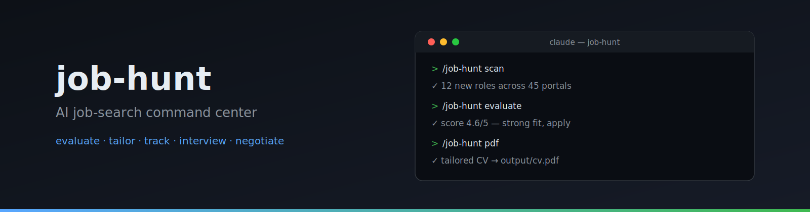

# Job-Hunt

<p align="center">
  
</p>

<p align="center">
  <em>I spent months applying to jobs the hard way. So I engineered the system I wish I had.</em><br>
  Companies use AI to filter candidates. <strong>I just gave candidates AI to <em>choose</em> companies.</strong><br>
  <em>Now it's open source.</em>
</p>

<p align="center">
  
  
  
  
  
  
  
  
  <a href="https://discord.gg/8pRpHETxa4"></a>
  <br>
  
  
  
  
  
  
  
  
  
</p>

---

## 📌 About This Version

This version is based on [santifer/career-ops](https://github.com/santifer/career-ops) and extends it with an **Interview Operating System** that closes the loop on the "beat by a hair" problem, plus a **Canonical Source-of-Truth pipeline** that keeps every generated CV and profile artifact consistent with one set of facts.

**What's been added on top of the upstream:**

| Area | Additions | Why |
|-------|-----------|-----|
| **Interview OS Phase 1** | `combat` mode, `debrief` mode, `data/interview-tracker.md`, Workday + YC W@S scrapers in `scan.mjs` | Capture interview intelligence + expand portal coverage |
| **Interview OS Phase 2** | `closing` mode, `weaknesses` mode, `analyze-interview-patterns.mjs`, `data/weakness-map.md`, debrief auto-trigger hook, combat weakness-map activation | Detect recurring loss patterns from debriefs and surface them at the highest-signal moment |
| **Canonical SoT** | `data/canonical.yml` + `data/canonical-narrative.md` + `data/canonical-rules.yml`, `gen-derived.mjs`, `drift-alert.mjs` | One source of truth for facts and prose; generated CVs can't drift (see `docs/CANONICAL_SOT.md`) |
| **Auxiliary** | `rejection` mode, `aging-alert.mjs`, `analyze-patterns.mjs` rejection integration, `followup` mode | Surface stale offers + classify rejections (ATS vs fit) + track follow-up cadence |

The result: a 21-mode system with an autonomous feedback loop. See the [Interview Operating System](#interview-operating-system) section below for the full data flow.

---

## What Is This

Job-Hunt turns any AI coding CLI into a full job search command center. Instead of manually tracking applications in a spreadsheet, you get an AI-powered pipeline that:

- **Evaluates offers** with a structured A-F scoring system (10 weighted dimensions)
- **Generates tailored PDFs** -- ATS-optimized CVs customized per job description
- **Scans portals** automatically (Greenhouse, Ashby, Lever, company pages)
- **Processes in batch** -- evaluate 10+ offers in parallel with sub-agents
- **Tracks everything** in a single source of truth with integrity checks

> **Important: This is NOT a spray-and-pray tool.** Job-hunt is a filter -- it helps you find the few offers worth your time out of hundreds. The system strongly recommends against applying to anything scoring below 4.0/5. Your time is valuable, and so is the recruiter's. Always review before submitting.

Job-hunt is agentic: Claude Code navigates career pages with Playwright, evaluates fit by reasoning about your CV vs the job description (not keyword matching), and adapts your resume per listing.

> **Heads up: the first evaluations won't be great.** The system doesn't know you yet. Feed it context -- your CV, your career story, your proof points, your preferences, what you're good at, what you want to avoid. The more you nurture it, the better it gets. Think of it as onboarding a new recruiter: the first week they need to learn about you, then they become invaluable.

Original author post [Read the full case study](https://santifer.io/career-ops-system).

## Features

| Feature | Description |
|---------|-------------|
| **Auto-Pipeline** | Paste a URL, get a full evaluation + PDF + tracker entry |
| **6-Block Evaluation** | Role summary, CV match, level strategy, comp research, personalization, interview prep (STAR+R) |
| **Interview Story Bank** | Accumulates STAR+Reflection stories across evaluations -- 5-10 master stories that answer any behavioral question |
| **Negotiation Scripts** | Salary negotiation frameworks, geographic discount pushback, competing offer leverage |
| **ATS PDF Generation** | Keyword-injected CVs with Space Grotesk + DM Sans design |
| **Portal Scanner** | 45+ companies pre-configured (Anthropic, OpenAI, ElevenLabs, Retool, n8n...) + custom queries across Ashby, Greenhouse, Lever, Wellfound |
| **Batch Processing** | Parallel evaluation with `claude -p` workers |
| **Dashboard TUI** | Terminal UI to browse, filter, and sort your pipeline |
| **Human-in-the-Loop** | AI evaluates and recommends, you decide and act. The system never submits an application -- you always have the final call |
| **Pipeline Integrity** | Automated merge, dedup, status normalization, health checks |
| **Interview Combat Manual** *(Phase 1)* | Per-company tactical prep: 3-island story strategy, transition pivots, anticipated questions with prepared angles, decision-pushing close. Stakeholder-aware when LinkedIn URLs provided |
| **Post-Interview Debrief** *(Phase 1)* | Conversational structured capture: what landed, what fumbled, per-interviewer signals, gut-feel verdict. Persists to `interview-prep/debriefs/` and `data/interview-tracker.md` |
| **Final-Round Closing Manual** *(Phase 2)* | Final-round-specific prep: stakeholder map (per-panel-member deep-dive), business-led case-study openings, first-90-days plan, verbatim closing pitches. Targets the documented "beat by a hair" pattern |
| **Auto-Pattern Detection** *(Phase 2)* | Deterministic analyzer reads all debriefs + tracker + rejections, computes confidence-tiered patterns (High/Medium/Low), writes `data/weakness-map.md`. Auto-fires the prescription card after every neck-and-neck loss |
| **Rejection Pattern Analysis** | `rejection` mode classifies rejections (automated/human/ghosted) and feeds `analyze-patterns.mjs` for ATS-vs-fit-failure diagnosis |
| **Aging Alert** | `aging-alert.mjs` runs at session start to surface 4.5+ scored offers that have been unapplied for 3+ days (so high-fit roles don't go stale in pipeline) |
| **Follow-up Cadence Tracker** | `followup-cadence.mjs` calculates which applications need follow-up nudges and generates draft messages |

## Installation — Step by Step

### Step 0 — Prerequisites

You need three things installed before starting:

1. **Node.js 18 or newer** — check with `node --version`. If missing, install from [nodejs.org](https://nodejs.org) or via `brew install node` (macOS).
2. **Claude Code** — the AI CLI this system runs on. Install and authenticate:
   ```bash
   npm install -g @anthropic-ai/claude-code
   claude   # first run walks you through login
   ```
   (OpenCode and Gemini CLI also work — see their sections below — but Claude Code is the primary target.)
3. **Git** — check with `git --version`.

Optional: **Go 1.21+** if you want the terminal dashboard (you can skip this and add it later).

### Step 1 — Clone and install dependencies

```bash
git clone https://github.com/Huyzus/job-hunt.git
cd job-hunt
npm install
npx playwright install chromium   # headless browser — required for PDF generation and job-page verification
```

### Step 2 — Verify your setup

```bash
npm run doctor
```

This validates prerequisites and tells you exactly what's missing. Fix anything it flags before continuing.

> **Note:** on a fresh install, `node test-all.mjs` skips the `gen-derived.mjs --check` step with a warning — it needs your personal canonical files, which don't exist yet. Step 5 creates them.

### Step 3 — Create your config files

```bash
cp config/profile.example.yml config/profile.yml     # your identity, target roles, comp range
cp templates/portals.example.yml portals.yml          # companies + queries the scanner watches
```

Open both in an editor and fill in your details — or skip the manual editing and let Claude do it in Step 5.

### Step 4 — Add your CV

Create `cv.md` in the project root with your full CV in markdown (plain headings and bullets — see `examples/cv-example.md` for the expected shape). This file is gitignored, stays on your machine, and is the source the AI reads for every evaluation.

### Step 5 — Let Claude finish the onboarding

```bash
claude   # open Claude Code inside the project directory
```

On first run, Claude detects the missing pieces and walks you through them conversationally — this is the easiest path. It will help you:

- Convert a pasted CV or LinkedIn profile into `cv.md` (if you skipped Step 4)
- Build your **canonical source-of-truth files**: `data/canonical.yml` (facts: name, comp targets, project metrics) and `data/canonical-narrative.md` (prose: your story, project descriptions)
- Run `node gen-derived.mjs` to generate your profile and base CVs from canonical
- Tailor the archetypes, scoring, and portals to your field — just say things like:
  - *"Change the archetypes to backend engineering roles"*
  - *"Add these 5 companies to portals.yml"*
  - *"Update my profile with this CV I'm pasting"*

> **The system is designed to be customized by Claude itself.** Modes, archetypes, scoring weights, negotiation scripts — just ask. It reads the same files it uses, so it knows exactly what to edit. The first evaluations won't be great until it knows you — feed it context like you'd onboard a recruiter.

### Step 6 — First run

Inside Claude Code:

- Paste any job posting URL → full auto-pipeline (evaluation + tailored PDF + tracker entry)
- `/job-hunt` → menu of all 21 modes
- `/job-hunt scan` → sweep the portals in `portals.yml` for new openings

See [docs/SETUP.md](docs/SETUP.md) for the full setup guide and [docs/CUSTOMIZATION.md](docs/CUSTOMIZATION.md) for deeper personalization.

## Gemini CLI Integration

Job-hunt supports [Gemini CLI](https://github.com/google-gemini/gemini-cli) natively — the same way it supports Claude Code and OpenCode. All 15 slash commands are available, using the same `modes/*.md` evaluation logic.

### Option A — Native Gemini CLI (Recommended)

```bash
# 1. Install Gemini CLI
npm install -g @google/gemini-cli
# or: npx @google/gemini-cli --version

# 2. Authenticate (free — uses your Google account)
gemini auth

# 3. Run in the job-hunt directory
cd job-hunt
gemini

# 4. Use slash commands just like Claude Code
/job-hunt "Senior AI Engineer at Anthropic..."
/job-hunt-evaluate --file ./jds/openai.txt
/job-hunt-scan
/job-hunt-pdf
/job-hunt-tracker
```

The `GEMINI.md` file is auto-loaded as context. All 15 commands are defined in `.gemini/commands/*.toml`.

### Option B — Standalone API Script (No CLI install needed)

```bash
# 1. Get a free API key at https://aistudio.google.com/apikey
cp .env.example .env
# Edit .env → set GEMINI_API_KEY=your_key_here

# 2. Install dependencies
npm install

# 3. Evaluate a job description
node gemini-eval.mjs "We are looking for a Senior AI Engineer..."
node gemini-eval.mjs --file ./jds/my-job.txt
npm run gemini:eval -- "JD text here"
```

> **Free tier:** Both options work without billing. Native CLI uses Google OAuth; the API script uses `gemini-2.0-flash` (15 RPM, 1M tokens/day free).

## Usage

Job-hunt is a single slash command with multiple modes. **21 modes total** (14 upstream + 7 added across Phase 1 + Phase 2 + auxiliary).

### Discovery + auto-pipeline
```
/job-hunt                  → Show all available commands
/job-hunt {paste a JD}     → Full auto-pipeline (evaluate + PDF + tracker)
/job-hunt pipeline         → Process pending URLs from data/pipeline.md
```

### Evaluation + comparison
```
/job-hunt evaluate         → Single offer A-G evaluation
/job-hunt compare          → Compare and rank multiple offers
/job-hunt scan             → Scan 85+ portals for new offers (Greenhouse + Ashby + Lever + Workday + YC W@S)
/job-hunt batch            → Parallel batch evaluation with claude -p workers
/job-hunt tracker          → View application status
```

### Application surfaces
```
/job-hunt apply            → Fill application forms with AI assist (Playwright)
/job-hunt pdf              → Generate ATS-optimized CV (Playwright HTML→PDF)
/job-hunt latex            → Export CV as LaTeX/Overleaf .tex
/job-hunt outreach         → LinkedIn outreach: identify targets + draft message
/job-hunt deep             → Deep company research (web search synthesis)
/job-hunt training         → Evaluate a course/cert against your North Star
/job-hunt project          → Evaluate a portfolio project idea
```

### Interview Operating System (Phase 1 + 2)
```
/job-hunt combat {company}      → Generate tactical interview combat manual
/job-hunt debrief {company}     → Capture post-interview intelligence (auto-fires weaknesses if pattern threshold crossed)
/job-hunt closing {company}     → Final-round prep manual (stakeholder map + business framing + closing moves)
/job-hunt weaknesses            → Pattern analysis from debriefs (card by default; --full for evidence appendix)
```

### Pattern + cadence intelligence
```
/job-hunt patterns         → Analyze rejection patterns (ATS-vs-fit, by archetype, by remote policy)
/job-hunt rejection        → Log a new rejection (classifies type + extracts signal)
/job-hunt followup         → Follow-up cadence tracker: flag overdue + generate drafts
```

Or just paste a job URL or description directly — job-hunt auto-detects it and runs the full pipeline.

### Background scripts (run automatically or via npm)
- `aging-alert.mjs` — runs at session start; surfaces 4.5+ scored offers stale for 3+ days
- `analyze-patterns.mjs` — rejection pattern detector (called by `/job-hunt patterns`)
- `analyze-interview-patterns.mjs` — interview pattern detector (called by `/job-hunt debrief` Step 9.5 and `/job-hunt weaknesses`)
- `followup-cadence.mjs` — follow-up calculator (called by `/job-hunt followup`)
- `update-system.mjs` — checks upstream for releases, applies updates without touching User Layer files
- `verify-pipeline.mjs` — pipeline integrity checks
- `merge-tracker.mjs` — merges batch tracker additions into `data/applications.md`

## How It Works

```
You paste a job URL or description
        │
        ▼
┌──────────────────┐
│  Archetype       │  Classifies: LLMOps / Agentic / PM / SA / FDE / Transformation
│  Detection       │
└────────┬─────────┘
         │
┌────────▼─────────┐
│  A-F Evaluation  │  Match, gaps, comp research, STAR stories
│  (reads cv.md)   │
└────────┬─────────┘
         │
    ┌────┼────┐
    ▼    ▼    ▼
 Report  PDF  Tracker
  .md   .pdf   .tsv
```

## Interview Operating System

Phase 1 + Phase 2 added an autonomous interview-feedback loop on top of the upstream evaluation system. The loop closes the gap between *what got recommended* and *what actually happened in the interview room*.

### Data flow

```
┌──────────────────────────────────────────────────────────────────────────┐
│ Interview happens                                                        │
└────────────────────┬─────────────────────────────────────────────────────┘
                     │
                     ▼
        /job-hunt debrief {company}
          - captures: what landed, what fumbled, interviewer signals,
            comp/timeline signals, gut-feel verdict, pattern tags
          - writes: interview-prep/debriefs/{slug}-{round}-{date}.md
          - appends row to data/interview-tracker.md
          - invokes: node analyze-interview-patterns.mjs --json (Step 9.5)
                     │
                     ▼
   ┌──────────────────────────────────────────────────────────────────┐
   │  analyze-interview-patterns.mjs (deterministic, ~50ms)           │
   │  - parses all debriefs + tracker + rejection-log                 │
   │  - computes confidence-tiered patterns:                          │
   │      High   ≥3 occurrences AND ≤60d AND >50% of stage-relevant  │
   │      Medium ≥2 occurrences AND ≤90d                              │
   │      Low    1 occurrence OR >90 days old                         │
   │  - writes data/weakness-map.md (atomic, hash-checked)            │
   │  - returns JSON: {threshold_hit, fired_reason, ...}              │
   └────────────────────┬─────────────────────────────────────────────┘
                        │
       ┌────────────────┴────────────────┐
       ▼ threshold_hit=true              ▼ false
   debrief mode auto-prepends         silent — weakness-map updated;
   "🚨 Pattern threshold crossed"     no surface change to user
   then renders weaknesses card
                        │
   ┌────────────────────┴────────────────────────────────────────────┐
   │  Consumer modes (read data/weakness-map.md on every invocation) │
   │                                                                 │
   │  /job-hunt combat {company}   → Pre-Built Weak-Spot Defenses  │
   │     activated; story selection biased by Story-Specific         │
   │     Performance table (avoid repeated fumblers)                 │
   │                                                                 │
   │  /job-hunt closing {company}  → Final-round-specific patterns │
   │     filtered into Weak Spots to Defend section; competitive     │
   │     intel + stakeholder map + business-led framing              │
   │                                                                 │
   │  /job-hunt weaknesses         → Prescription card on demand   │
   │     (top 3 patterns + drills) or --full for evidence appendix   │
   └─────────────────────────────────────────────────────────────────┘
```

### What each mode actually does

**`combat`** — Tactical prep for any interview round. Generates a per-company combat manual at `interview-prep/{company-slug}-{role-slug}.md` with: 3-island story strategy (Center HUD + per-island visuals/angle/logic/agency), transition playbook (verbatim pivot scripts), question bank with prepared angles, decision-pushing close, action-item checklist. Reads weakness-map (when seeded) to populate Pre-Built Weak-Spot Defenses.

**`debrief`** — Conversational post-interview capture (one question at a time; ~30 minutes after the interview). Captures: what landed, what fumbled (with reasons), per-interviewer sentiment + signals, comp/timeline/process signals, gut-feel 1-10 verdict, pattern tags. Persists to `interview-prep/debriefs/{slug}-{round}-{date}.md` and appends a row to `data/interview-tracker.md`. Step 9.5 invokes the pattern analyzer and conditionally fires the weaknesses card.

**`closing`** — Final-round-specific prep. Generates a closing manual at `interview-prep/{company-slug}-{role-slug}-closing.md` with: stakeholder map (per-panel-member: what they care about, what worries them about you, your wedge, decision weight), business-led case-study openings (drilled to land in 30 seconds), 3-act first-90-days plan, verbatim "why me/why now/closing question" pitches, weak spots to defend filtered to final-round patterns. Requires LinkedIn URLs for the panel for the deepest version.

**`weaknesses`** — Pattern analysis surface. Default: prescription card (top 3 patterns + one-line drills + win pattern to leverage). `--full`: appendix with per-stage breakdown, per-interviewer-role patterns, story performance table, cross-pattern observations, evidence quotes from contributing debriefs. Auto-fires after debriefs when threshold crosses.

### Auto-trigger semantics

The pattern analyzer fires when ANY of:
- A new "Lost (neck and neck)" debrief appears since the last fire (the highest-signal moment)
- ≥2 new High-confidence patterns have emerged since last fire

Suppress by setting `weaknesses.auto_trigger: false` in `config/profile.yml`.

### Files

- **Producer** (deterministic): `analyze-interview-patterns.mjs` — single-purpose, snapshot-tested, ~700 lines
- **Contract** (auto-generated): `data/weakness-map.md` — User Layer (gitignored), structured tables consumable by all three modes
- **Consumers** (LLM-driven): `modes/combat.md`, `modes/closing.md`, `modes/weaknesses.md`
- **Hook**: `modes/debrief.md` Step 9.5 invokes the analyzer after every debrief
- **Tests**: `test/test-analyze-interview-patterns.mjs` (21 unit + snapshot tests, 8 fixture debriefs)

---

## Pre-configured Portals

The scanner comes with **45+ companies** ready to scan and **19 search queries** across major job boards. Copy `templates/portals.example.yml` to `portals.yml` and add your own:

**AI Labs:** Anthropic, OpenAI, Mistral, Cohere, LangChain, Pinecone
**Voice AI:** ElevenLabs, PolyAI, Parloa, Hume AI, Deepgram, Vapi, Bland AI
**AI Platforms:** Retool, Airtable, Vercel, Temporal, Glean, Arize AI
**Contact Center:** Ada, LivePerson, Sierra, Decagon, Talkdesk, Genesys
**Enterprise:** Salesforce, Twilio, Gong, Dialpad
**LLMOps:** Langfuse, Weights & Biases, Lindy, Cognigy, Speechmatics
**Automation:** n8n, Zapier, Make.com
**European:** Factorial, Attio, Tinybird, Clarity AI, Travelperk

**Job boards searched:** Ashby, Greenhouse, Lever, Wellfound, Workable, RemoteFront

## Dashboard TUI

The built-in terminal dashboard lets you browse your pipeline visually:

```bash
cd dashboard
go build -o career-dashboard .
./career-dashboard --path ..
```

Features: 6 filter tabs, 4 sort modes, grouped/flat view, lazy-loaded previews, inline status changes.

## Project Structure

```
job-hunt/
├── CLAUDE.md                    # Agent instructions
├── cv.md                        # Your CV (create this)
├── article-digest.md            # Your proof points (optional)
├── config/
│   └── profile.example.yml      # Template for your profile
├── modes/                       # 21 skill modes (14 upstream + 7 added)
│   ├── _shared.md               # Shared context (system layer)
│   ├── _profile.md              # User narrative + archetypes (User Layer — gitignored)
│   ├── auto-pipeline.md         # Paste a JD → evaluate + PDF + tracker
│   ├── evaluate.md              # Single offer A-G evaluation
│   ├── compare.md               # Multi-offer ranking
│   ├── pdf.md                   # PDF generation
│   ├── latex.md                 # LaTeX/Overleaf export
│   ├── scan.md                  # Portal scanner (Greenhouse/Ashby/Lever/Workday/YC W@S)
│   ├── pipeline.md              # Process pending URLs
│   ├── batch.md                 # Parallel batch processing
│   ├── tracker.md               # Application status overview
│   ├── apply.md                 # Live form-fill assistant
│   ├── outreach.md              # LinkedIn outreach
│   ├── deep.md                  # Deep company research
│   ├── training.md              # Course/cert evaluation
│   ├── project.md               # Portfolio project evaluation
│   ├── combat.md                # Tactical interview prep manual (Phase 1)
│   ├── debrief.md               # Post-interview structured capture (Phase 1)
│   ├── closing.md               # Final-round prep manual (Phase 2)
│   ├── weaknesses.md            # Pattern analysis card + appendix (Phase 2)
│   ├── patterns.md              # Rejection pattern analysis
│   ├── rejection.md             # Log + classify a rejection
│   └── followup.md              # Follow-up cadence tracker
├── analyze-patterns.mjs         # Rejection pattern detector
├── analyze-interview-patterns.mjs  # Interview pattern detector (Phase 2)
├── aging-alert.mjs              # Surface stale 4.5+ unapplied offers (session-start)
├── followup-cadence.mjs         # Follow-up calculator
├── scan.mjs                     # Zero-token portal scanner
├── update-system.mjs            # Upstream update checker
├── verify-pipeline.mjs          # Pipeline integrity checks
├── merge-tracker.mjs            # Merge batch tracker additions
├── test/                        # Phase 2 fixtures + snapshot tests
│   ├── fixtures/debriefs/       # 8 fixture debriefs covering outcome types
│   ├── fixtures/expected-weakness-map.md  # Snapshot baseline
│   └── test-analyze-interview-patterns.mjs  # 21 unit + snapshot assertions
├── templates/
│   ├── cv-template.html         # ATS-optimized CV template
│   ├── portals.example.yml      # Scanner config template
│   └── states.yml               # Canonical statuses
├── batch/
│   ├── batch-prompt.md          # Self-contained worker prompt
│   └── batch-runner.sh          # Orchestrator script
├── dashboard/                   # Go TUI pipeline viewer
├── data/                        # Tracking data (User Layer — mostly gitignored)
│   ├── applications.md          # Master application tracker (gitignored)
│   ├── interview-tracker.md     # Per-round interview log with outcomes (Phase 1)
│   ├── weakness-map.md          # Auto-generated pattern map (Phase 2 — gitignored)
│   ├── rejection-log.md         # Structured rejection log
│   ├── pipeline.md              # Inbox of pending URLs (gitignored)
│   └── scan-history.tsv         # Scanner dedup history (gitignored)
├── interview-prep/              # Interview artifacts (User Layer — gitignored)
│   ├── story-bank.md            # Master STAR+R story bank (often symlinked to vault)
│   ├── debriefs/                # Per-interview debrief files (gitignored except .gitkeep)
│   └── {company}-{role}*.md     # Combat manuals + closing manuals (gitignored)
├── reports/                     # Evaluation reports (gitignored)
├── output/                      # Generated PDFs (gitignored)
├── fonts/                       # Space Grotesk + DM Sans
├── docs/                        # Setup, customization, architecture
└── examples/                    # Sample CV, report, proof points
```

### Canonical Source of Truth

Profile data (`config/profile.yml`, `modes/_profile.md`, `article-digest.md`, `cv-builder.md`, `cv-pd.md`) is generated — **do not hand-edit these files**.

| Canonical file | Purpose |
|----------------|---------|
| `data/canonical.yml` | Identity, targets, comp range, project metrics |
| `data/canonical-narrative.md` | Prose chunks: opener, exit story, project bullets |
| `data/canonical-rules.yml` | Drift-alert rules for stale-derivation detection |

After editing canonical sources, regenerate derived files:

```bash
node gen-derived.mjs          # Regenerate all derived files
node drift-alert.mjs          # Check for drift / stale derivations
```

See `DATA_CONTRACT.md` for the full three-layer contract (User Layer / Generated Layer / System Layer).

## Tech Stack


- **Agent**: Claude Code with custom skills and modes
- **PDF**: Playwright/Puppeteer + HTML template
- **Scanner**: Playwright + Greenhouse API + WebSearch
- **Dashboard**: Go + Bubble Tea + Lipgloss (Catppuccin Mocha theme)
- **Data**: Markdown tables + YAML config + TSV batch files

## Also Open Source

- **[cv-santiago](https://github.com/santifer/cv-santiago)** -- The portfolio website (santifer.io) with AI chatbot, LLMOps dashboard, and case studies. If you need a portfolio to showcase alongside your job search, fork it and make it yours.

## About the Author

I'm Santiago -- Head of Applied AI, former founder (built and sold a business that still runs with my name on it). I built job-hunt to manage my own job search. It worked: I used it to land my current role.

My portfolio and other open source projects → [santifer.io](https://santifer.io)

☕ [Buy me a coffee](https://buymeacoffee.com/santifer) if job-hunt helped your job search.

## Star History

<a href="https://www.star-history.com/?repos=santifer%2Fcareer-ops&type=timeline&legend=top-left">
 <picture>
   <source media="(prefers-color-scheme: dark)" srcset="https://api.star-history.com/chart?repos=santifer/career-ops&type=timeline&theme=dark&legend=top-left" />
   <source media="(prefers-color-scheme: light)" srcset="https://api.star-history.com/chart?repos=santifer/career-ops&type=timeline&legend=top-left" />
   
 </picture>
</a>

## Disclaimer

**job-hunt is a local, open-source tool — NOT a hosted service.** By using this software, you acknowledge:

1. **You control your data.** Your CV, contact info, and personal data stay on your machine and are sent directly to the AI provider you choose (Anthropic, OpenAI, etc.). We do not collect, store, or have access to any of your data.
2. **You control the AI.** The default prompts instruct the AI not to auto-submit applications, but AI models can behave unpredictably. If you modify the prompts or use different models, you do so at your own risk. **Always review AI-generated content for accuracy before submitting.**
3. **You comply with third-party ToS.** You must use this tool in accordance with the Terms of Service of the career portals you interact with (Greenhouse, Lever, Workday, LinkedIn, etc.). Do not use this tool to spam employers or overwhelm ATS systems.
4. **No guarantees.** Evaluations are recommendations, not truth. AI models may hallucinate skills or experience. The authors are not liable for employment outcomes, rejected applications, account restrictions, or any other consequences.

See [LEGAL_DISCLAIMER.md](LEGAL_DISCLAIMER.md) for full details. This software is provided under the [MIT License](LICENSE) "as is", without warranty of any kind.

## Contributors

<a href="https://github.com/santifer/career-ops/graphs/contributors">
  
</a>

Got hired using job-hunt? [Share your story!](https://github.com/santifer/career-ops/issues/new?template=i-got-hired.yml)

## License

MIT

## Let's Connect

[](https://santifer.io)
[](https://linkedin.com/in/santifer)
[](https://x.com/santifer)
[](https://discord.gg/8pRpHETxa4)
[](mailto:hi@santifer.io)
[](https://buymeacoffee.com/santifer)
